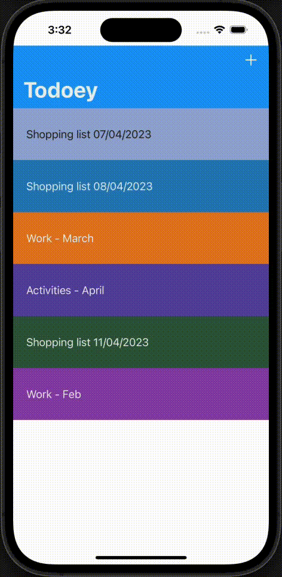

# Todoey

## What this app is about

A colorful todolist app to keep track of your tasks in different catogories.

## Main technical points

- Local data persistence: UserDefaults, Core Data and Realm CRUD operations
- TableView, ReusableCell, implement delegate methods, Swift extensions, make cell swipable 
- Modeling apps with serveral hierachy: categories and items of todo list
- Navigation controller
- Integration with third party libraries with CocaPods
- Stylying an app with gradient colors

